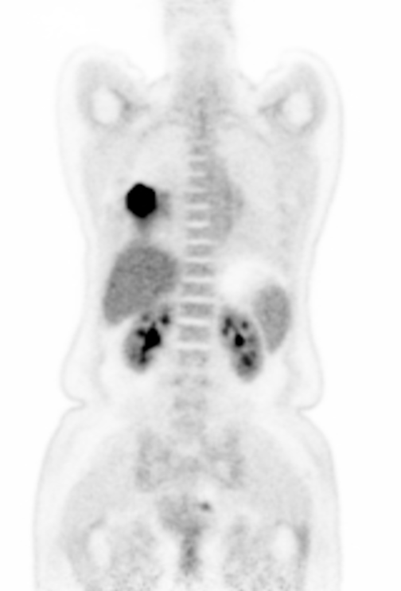

# Code for UDPSN will be available soon!

<table frame=void>
	<tr>
        <td>

        	
        	 
        	(a) Low-dose (DRF=12)
        

</td>    
     	<td>

    		
    		 
    		(b) 3D-cGAN
        

</td>
	</tr>	
    <tr>	<!--第二行-->
        <td>

        	
        	 
        	(c) UDPSN
        

</td>    
     	<td>

    		
    		 
    		(d) Full-dose
        

</td>
	</tr>
</table>

